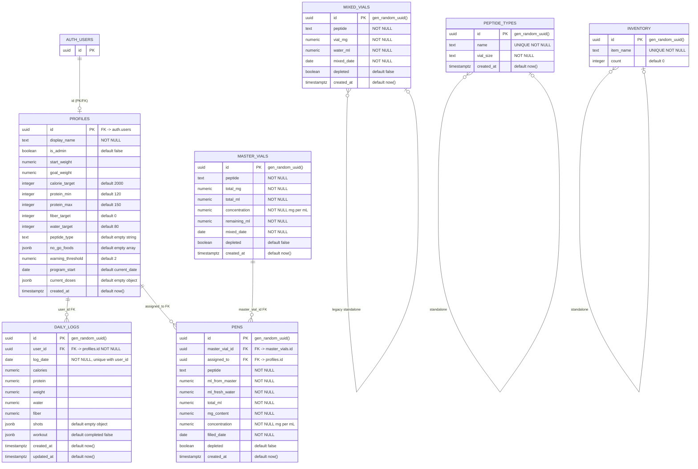

# Peptide Command Center -- Data Dictionary

This document describes every table, column, constraint, helper function, RLS policy,
JSONB schema, and realtime publication in the Supabase database.

---

## Entity-Relationship Diagram



---

## Table Details

### profiles

The core user record. Created at signup via a trigger or client-side insert. The
primary key is the same UUID as `auth.users.id`, establishing a 1:1 relationship.

| Column | Type | Constraints | Default | Description |
|---|---|---|---|---|
| id | uuid | PK, FK -> auth.users ON DELETE CASCADE | -- | Matches the Supabase Auth user UUID |
| display_name | text | NOT NULL | -- | Human-readable name shown in UI |
| is_admin | boolean | -- | false | Grants lab / mixing / inventory write access |
| start_weight | numeric | -- | NULL | Weight at program start (lbs) |
| goal_weight | numeric | -- | NULL | Target weight (lbs) |
| calorie_target | integer | -- | 2000 | Daily calorie ceiling |
| protein_min | integer | -- | 120 | Daily protein floor (g) |
| protein_max | integer | -- | 150 | Daily protein ceiling (g) |
| fiber_target | integer | -- | 0 | Daily fiber target (g) |
| water_target | integer | -- | 80 | Daily water target (oz) |
| peptide_type | text | -- | '' | Primary peptide protocol label |
| no_go_foods | jsonb | -- | '[]' | Array of prohibited food strings |
| warning_threshold | numeric | -- | 2 | Max lbs/week loss before Over-Loss Warning fires |
| program_start | date | -- | current_date | Date the user began the peptide program |
| current_doses | jsonb | -- | '{}' | Active dose map keyed by peptide name |
| created_at | timestamptz | -- | now() | Row creation timestamp |

### daily_logs

One row per user per calendar day. The composite unique constraint on
`(user_id, log_date)` prevents duplicate entries.

| Column | Type | Constraints | Default | Description |
|---|---|---|---|---|
| id | uuid | PK | gen_random_uuid() | Surrogate key |
| user_id | uuid | FK -> profiles.id ON DELETE CASCADE, NOT NULL | -- | Owning user |
| log_date | date | NOT NULL, UNIQUE(user_id, log_date) | -- | Calendar date this log covers |
| calories | numeric | -- | NULL | Total calories consumed |
| protein | numeric | -- | NULL | Grams of protein consumed |
| weight | numeric | -- | NULL | Morning weigh-in (lbs) |
| water | numeric | -- | NULL | Fluid ounces of water consumed |
| fiber | numeric | -- | NULL | Grams of fiber consumed |
| shots | jsonb | -- | '{}' | Injection log for the day (see JSONB schema below) |
| workout | jsonb | -- | '{"completed":false,"notes":""}' | Workout completion flag and free-text notes |
| created_at | timestamptz | -- | now() | Row creation timestamp |
| updated_at | timestamptz | -- | now() | Last modification timestamp |

### master_vials

Represents a reconstituted "mother vial" -- the first step of the two-tier mixing
protocol. Peptide powder is dissolved in BAC water to create a master concentrate.

| Column | Type | Constraints | Default | Description |
|---|---|---|---|---|
| id | uuid | PK | gen_random_uuid() | Surrogate key |
| peptide | text | NOT NULL | -- | Peptide name (e.g., "Retatrutide") |
| total_mg | numeric | NOT NULL | -- | Milligrams of peptide in the vial |
| total_ml | numeric | NOT NULL | -- | Millilitres of BAC water added |
| concentration | numeric | NOT NULL | -- | Calculated mg/mL = total_mg / total_ml |
| remaining_ml | numeric | NOT NULL | -- | Liquid remaining; decrements as pens are filled |
| mixed_date | date | NOT NULL | -- | Date of reconstitution; drives 28-day expiry |
| depleted | boolean | -- | false | True when remaining_ml reaches 0 |
| created_at | timestamptz | -- | now() | Row creation timestamp |

### pens

A 3 mL pen cartridge filled from a master vial. Each pen is assigned to exactly one
user (Zero-Shared Hardware rule).

| Column | Type | Constraints | Default | Description |
|---|---|---|---|---|
| id | uuid | PK | gen_random_uuid() | Surrogate key |
| master_vial_id | uuid | FK -> master_vials.id | NULL | Source master vial |
| assigned_to | uuid | FK -> profiles.id | NULL | User who owns this pen |
| peptide | text | NOT NULL | -- | Peptide name |
| ml_from_master | numeric | NOT NULL | -- | Volume drawn from the master vial |
| ml_fresh_water | numeric | NOT NULL | -- | Volume of fresh BAC water added to the pen |
| total_ml | numeric | NOT NULL | -- | ml_from_master + ml_fresh_water |
| mg_content | numeric | NOT NULL | -- | master concentration * ml_from_master |
| concentration | numeric | NOT NULL | -- | mg_content / total_ml (mg/mL) |
| filled_date | date | NOT NULL | -- | Date the pen was filled; drives 28-day expiry |
| depleted | boolean | -- | false | True when the pen is used up or expired |
| created_at | timestamptz | -- | now() | Row creation timestamp |

### mixed_vials (legacy)

The original single-tier vial table from migration 001. Retained for historical data.
New mixing operations use master_vials + pens instead.

| Column | Type | Constraints | Default | Description |
|---|---|---|---|---|
| id | uuid | PK | gen_random_uuid() | Surrogate key |
| peptide | text | NOT NULL | -- | Peptide name |
| vial_mg | numeric | NOT NULL | -- | Milligrams of peptide |
| water_ml | numeric | NOT NULL | -- | BAC water added |
| mixed_date | date | NOT NULL | -- | Reconstitution date |
| depleted | boolean | -- | false | True when used up |
| created_at | timestamptz | -- | now() | Row creation timestamp |

### peptide_types

Reference table listing every peptide the household tracks, along with its
standard vial size.

| Column | Type | Constraints | Default | Description |
|---|---|---|---|---|
| id | uuid | PK | gen_random_uuid() | Surrogate key |
| name | text | UNIQUE, NOT NULL | -- | Peptide name (e.g., "Retatrutide") |
| vial_size | text | NOT NULL | -- | Standard vial size label (e.g., "20mg") |
| created_at | timestamptz | -- | now() | Row creation timestamp |

### inventory

Simple item-count ledger for supplies (vials, syringes, swabs, etc.).

| Column | Type | Constraints | Default | Description |
|---|---|---|---|---|
| id | uuid | PK | gen_random_uuid() | Surrogate key |
| item_name | text | UNIQUE, NOT NULL | -- | Supply name (e.g., "Retatrutide 20mg") |
| count | integer | -- | 0 | Quantity on hand |

---

## Helper Function

### public.is_admin()

```sql
create or replace function public.is_admin()
returns boolean
language sql
security definer
set search_path = public
as $$
  select coalesce(
    (select is_admin from public.profiles where id = auth.uid()),
    false
  );
$$;
```

Returns `true` when the calling user's `profiles.is_admin` flag is `true`.
Declared `SECURITY DEFINER` so it can read `profiles` even when invoked inside
an RLS policy on a different table. Used in virtually every admin-gated policy.

---

## JSONB Schema Reference

### profiles.no_go_foods

A JSON array of strings. Each entry is a prohibited food or food category.

```json
[
  "Fried foods",
  "Carbonated drinks",
  "Liquid sugar (juice, soda, sweet tea)",
  "Raw cruciferous veggies (broccoli, cauliflower, cabbage)"
]
```

Karen's list adds `"SPINACH -- ALLERGY"` and `"Fried tempura, crispy tacos"`.

### profiles.current_doses

A JSON object keyed by peptide name. Values represent the active dose in milligrams
(or whatever unit the protocol specifies).

```json
{
  "Retatrutide": 1.0,
  "MOTS-c": 0.5,
  "Diamond Glow": 1.0,
  "Wolverine": 0.5
}
```

### daily_logs.shots

A JSON object keyed by peptide name. Each value records whether the injection
was taken and optionally the unit count.

```json
{
  "Retatrutide": { "done": true, "units": 15 },
  "MOTS-c": { "done": true, "units": 30 },
  "Diamond Glow": { "done": false, "units": 0 }
}
```

### daily_logs.workout

A JSON object with a completion flag and optional free-text notes.

```json
{
  "completed": true,
  "notes": "45 min Zone 2 cycling"
}
```

---

## Row-Level Security (RLS) Policy Summary

Every table has RLS enabled. All policies target the `authenticated` role.

### profiles

| Policy | Operation | Rule |
|---|---|---|
| profiles_select | SELECT | Any authenticated user can read all profiles |
| profiles_insert | INSERT | User can only insert their own row (`auth.uid() = id`) |
| profiles_update | UPDATE | Owner (`auth.uid() = id`) OR admin (`is_admin()`) |

No DELETE policy -- profiles are removed only by cascading from `auth.users`.

### daily_logs

| Policy | Operation | Rule |
|---|---|---|
| logs_select | SELECT | Owner (`auth.uid() = user_id`) OR admin |
| logs_insert | INSERT | Owner only |
| logs_update | UPDATE | Owner only |
| logs_delete | DELETE | Owner only |

### master_vials

| Policy | Operation | Rule |
|---|---|---|
| masters_select | SELECT | Any authenticated user |
| masters_insert | INSERT | Admin only |
| masters_update | UPDATE | Admin only |
| masters_delete | DELETE | Admin only |

### pens

| Policy | Operation | Rule |
|---|---|---|
| pens_select | SELECT | Owner (`auth.uid() = assigned_to`) OR admin (updated in migration 003) |
| pens_insert | INSERT | Admin only |
| pens_update | UPDATE | Admin only |
| pens_delete | DELETE | Admin only |

### mixed_vials (legacy)

| Policy | Operation | Rule |
|---|---|---|
| vials_select | SELECT | Any authenticated user |
| vials_insert | INSERT | Admin only |
| vials_update | UPDATE | Admin only |
| vials_delete | DELETE | Admin only |

### peptide_types

| Policy | Operation | Rule |
|---|---|---|
| peptides_select | SELECT | Any authenticated user |
| peptides_insert | INSERT | Admin only |
| peptides_delete | DELETE | Admin only |

No UPDATE policy -- types are immutable; delete and re-create to change.

### inventory

| Policy | Operation | Rule |
|---|---|---|
| inventory_select | SELECT | Any authenticated user |
| inventory_insert | INSERT | Admin only |
| inventory_update | UPDATE | Admin only |

No DELETE policy defined in the initial migration.

---

## Realtime Publication

The following tables are added to the `supabase_realtime` publication so that
subscribed clients receive live INSERT, UPDATE, and DELETE events:

| Table | Added In |
|---|---|
| mixed_vials | Migration 001 |
| inventory | Migration 001 |
| peptide_types | Migration 001 |
| master_vials | Migration 002 |
| pens | Migration 002 |

`profiles` and `daily_logs` are **not** in the realtime publication. The client
fetches those on demand (e.g., at login or when navigating to the dashboard).
