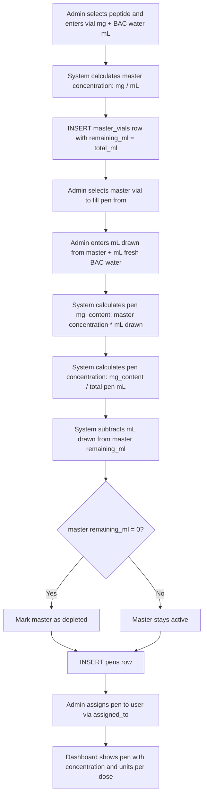
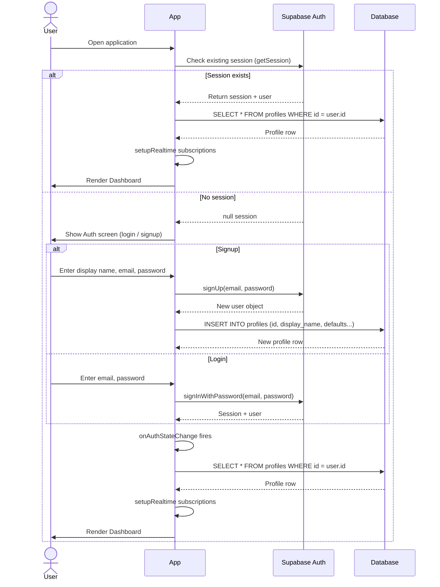
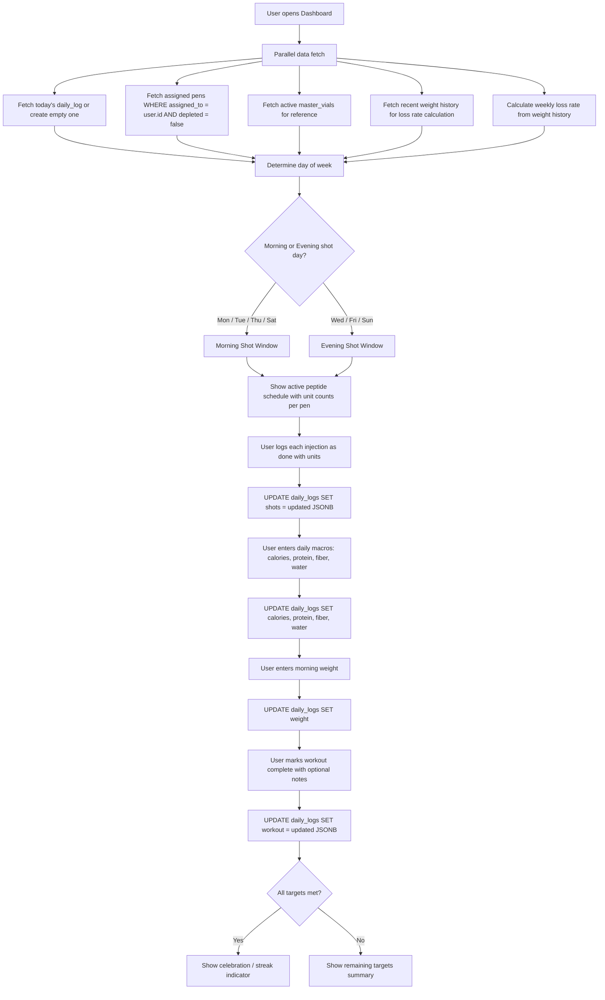
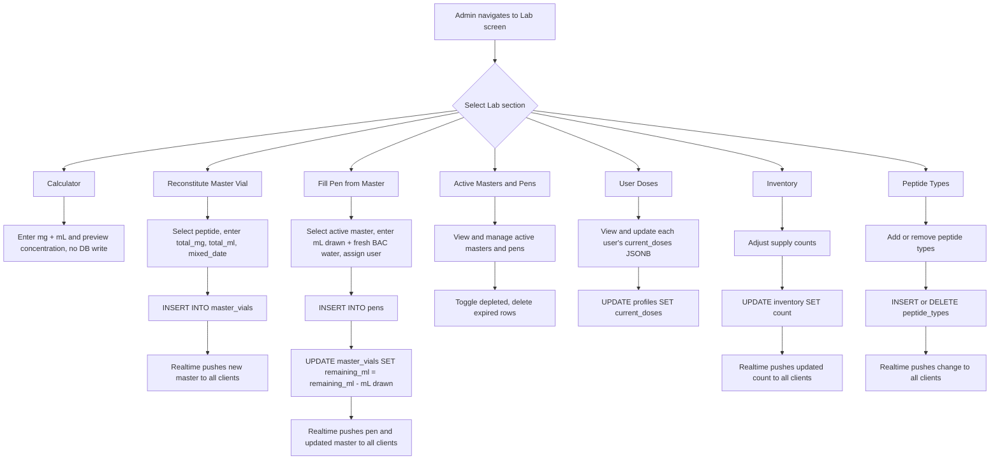
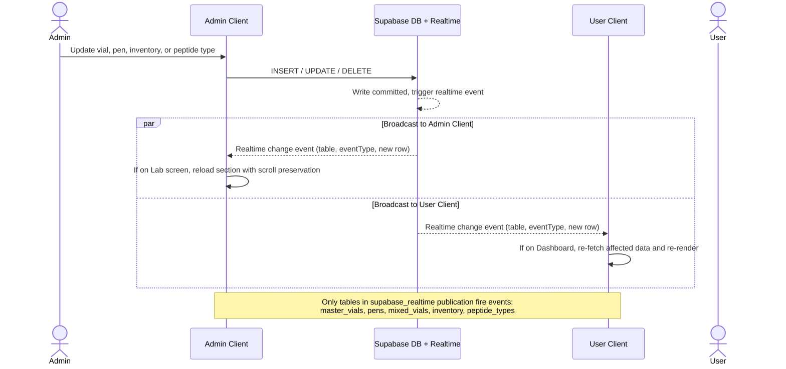
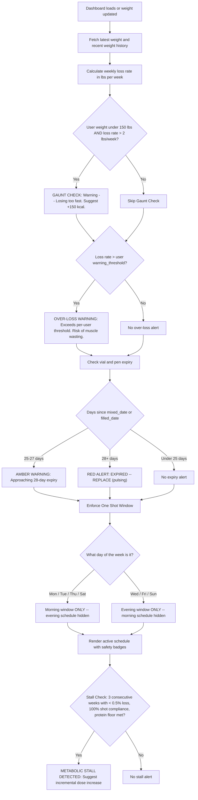

# Peptide Command Center -- Workflows

Visual workflow diagrams for every major flow in the application.

---

## 1. Mixing Workflow

The two-tier reconstitution protocol. An admin reconstitutes a master vial from
powder, then fills individual 3 mL pens from that master.

---

## 2. Authentication Flow

From app launch to a fully-subscribed realtime dashboard.

---

## 3. Daily User Flow

Everything a user does from opening the dashboard through completing their day.

---

## 4. Admin Lab Flow

The Lab screen is the admin's workbench for all mixing, inventory, and
configuration tasks.

---

## 5. Real-time Sync

How changes made by the admin propagate instantly to all connected clients.

---

## 6. Safety Rules Logic

All automated safety checks that run when the dashboard loads or when weight
data changes.

